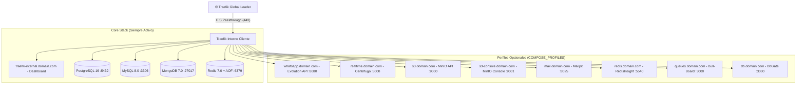

# 🚀 Client Infrastructure Stack (inf-infra)

Stack modular de infraestructura y servicios aislados por cliente/dominio. Integra proxy inverso **Traefik v3**, bases de datos (PostgreSQL 16, MySQL 8, MongoDB 7, Redis 7 con persistencia AOF), WebSockets en tiempo real (**Centrifugo**), almacenamiento de objetos compatible con S3 (**MinIO**), pasarela de mensajería (**Evolution API v2**) y herramientas de observabilidad local.

---

## 🏛️ Arquitectura



---

## 🛠 Servicios y Herramientas Integradas

| Servicio / Herramienta | Perfil / Activación | URL por Defecto (Configurable en `.env`) | Descripción |
| :--- | :--- | :--- | :--- |
| **Traefik Interno** | *(Core)* | `https://traefik-internal.<dominio>/dashboard/` | Proxy interno con reglas de aislamiento multi-dominio. |
| **PostgreSQL** | *(Core)* | `postgres:5432` *(Red interna)* | Motor relacional PostgreSQL 16. |
| **MySQL** | *(Core)* | `mysql:3306` *(Red interna)* | Motor relacional MySQL 8.0 con scripts de auto-init. |
| **MongoDB** | *(Core)* | `mongodb:27017` *(Red interna)* | Base de datos documental NoSQL MongoDB 7.0. |
| **Redis (Cache & Colas)** | *(Core)* | `redis:6379` *(Red interna)* | Motor en memoria con persistencia en disco (AOF). |
| **Evolution API v2** | `whatsapp`, `dev` | `https://whatsapp.<dominio>` | Pasarela REST API para automatización de WhatsApp. |
| **Centrifugo (Realtime)** | `realtime`, `dev` | `https://realtime.<dominio>` | Servidor escalable de WebSockets y eventos Pub/Sub. |
| **MinIO (S3 API & Console)**| `s3`, `minio`, `dev` | `https://s3.<dominio>` / `https://s3-console.<dominio>` | Almacenamiento de objetos S3 compatible. |
| **DbGate** | `dbgate`, `tools`, `dev` | `https://db.<dominio>` | Administrador web moderno para SQL, Postgres, Mongo y Redis. |
| **RedisInsight** | `redisinsight`, `tools`, `dev` | `https://redis.<dominio>` | Visualizador gráfico de claves, Streams y memoria de Redis. |
| **Bull-Board** | `queues`, `tools`, `dev` | `https://queues.<dominio>` | Panel de monitoreo e inspección de colas Bull / BullMQ. |
| **Mailpit** | `mail`, `tools`, `dev` | `https://mail.<dominio>` | Servidor SMTP local y visor de correos capturados. |

---

## 🌐 Subdominios Personalizables en `.env`

Todos los subdominios se pueden renombrar libremente sin alterar el código:

```bash
SUBDOMAIN_TRAEFIK=traefik-internal
SUBDOMAIN_EVOLUTION=whatsapp
SUBDOMAIN_CENTRIFUGO=realtime
SUBDOMAIN_REDISINSIGHT=redis
SUBDOMAIN_QUEUES=queues
SUBDOMAIN_DBGATE=db
SUBDOMAIN_MAILPIT=mail
SUBDOMAIN_MINIO=s3
SUBDOMAIN_MINIO_CONSOLE=s3-console
```

---

## 💬 Uso de Evolution API v2 (WhatsApp REST API)

### 1. Panel de Administración Web (Manager UI)
Accede a la interfaz web para crear instancias, vincular números con código QR y configurar webhooks:
- **URL**: `https://whatsapp.<dominio>/manager/`
- **Autenticación**: Tu clave global `WA_API_KEY` definida en `.env`.

### 2. Envío de Mensajes de Texto (`sendText`)
Puedes enviar mensajes desde cualquier backend (PHP, Node, Python, Laravel) o terminal con cURL:

```bash
curl -X POST "https://whatsapp.<dominio>/message/sendText/<NOMBRE_INSTANCIA>" \
  -H "Content-Type: application/json" \
  -H "apikey: <TU_API_KEY>" \
  -d '{
    "number": "593997631577",
    "text": "¡Hola! Mensaje enviado desde la API 🚀"
  }'
```

> [!NOTE]
> - El campo `number` debe incluir el código de país sin el signo `+` ni espacios (ej. `593997631577` para Ecuador).
> - En `apikey` puedes usar la clave global (`WA_API_KEY`) o el token individual generado para esa instancia.
> - La persistencia de las sesiones de WhatsApp y la caché en Redis están integradas automáticamente en los volúmenes `evolution-instances` y `evolution-store`.

---

## ⚡ Conexión con Centrifugo (WebSockets & Realtime)

- **Endpoint WebSocket para Clientes (Frontend / Web / Mobile)**:
  `wss://realtime.<dominio>/connection/websocket`
- **Endpoint HTTP API para Backends**:
  - Externo: `https://realtime.<dominio>/api`
  - Interno en Docker: `http://centrifugo:8000/api`
  - Header de autenticación: `Authorization: apikey <CENTRIFUGO_API_KEY>`

---

## 🚀 Control de Servicios con `COMPOSE_PROFILES`

En el archivo `.env`, define qué servicios opcionales se iniciarán con la variable `COMPOSE_PROFILES`:

```bash
# Iniciar todo el stack completo (desarrollo / pruebas integrales):
COMPOSE_PROFILES=dev

# Iniciar solo el servidor de WebSockets:
COMPOSE_PROFILES=realtime

# Iniciar WebSockets + WhatsApp + Almacenamiento S3:
COMPOSE_PROFILES=realtime,whatsapp,s3

# Iniciar únicamente las herramientas administrativas:
COMPOSE_PROFILES=tools

# Iniciar únicamente el núcleo base (Traefik + Bases de datos):
COMPOSE_PROFILES=
```

### Comandos directos con `Makefile`:

```bash
make up               # Inicia según la variable COMPOSE_PROFILES de tu .env
make up-dev           # Inicia todo el stack completo de desarrollo
make up-realtime      # Inicia núcleo + Centrifugo (WebSockets)
make up-tools         # Inicia herramientas administrativas (DbGate, Mailpit, RedisInsight, Bull-Board)
make up-core          # Inicia únicamente Traefik y las bases de datos
make up PROFILES=s3   # Inicia perfiles específicos sobre la marcha
make ps               # Inspecciona el estado de los contenedores
make logs             # Muestra los logs en tiempo real
make down             # Detiene el stack completo
```

---

## 💾 Importación y Respaldo de Bases de Datos

### Importación Rápida de Datos
```bash
# MySQL (.sql, .sql.gz, .zip)
make import-mysql <nombre_db> <ruta_archivo>

# PostgreSQL (.sql, .sql.gz, .zip, .dump, .custom)
make import-postgres <nombre_db> <ruta_archivo>

# MongoDB (.json, .json.gz, .zip, .archive)
make import-mongo <nombre_db> <ruta_archivo> [<coleccion>]
```

### Respaldos y Sincronización S3 (DigitalOcean Spaces / MinIO)
```bash
# Ejecutar respaldo manual
make backup TYPE=daily

# Configurar tareas cron de respaldo automatizado
make setup-cron
```

---

## 🛡️ Despliegue en Producción y Cloudflare Zero Trust

1. **Red Externa**: Asegúrate de que `global-transit-network` esté creada:
   ```bash
   docker network create global-transit-network || true
   ```
2. **Cloudflare Zero Trust**:
   - Agrega la regla wildcard `*.tudominio.com` en Cloudflare Tunnel apuntando a `https://global-traefik-leader:443` con `No TLS Verify: true` y `Match SNI: true`.
   - Crea aplicaciones en **Cloudflare Access** para proteger los subdominios sensibles (`traefik-internal`, `db`, `redis`, `queues`, `s3-console`) y políticas **Bypass** para los endpoints públicos (`whatsapp`, `realtime`, `s3`).
